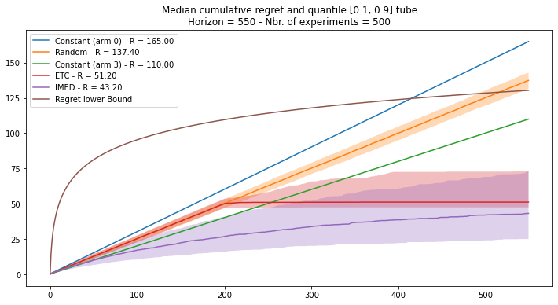

# Forban
## Exploit and Explore a bandit environment and sequential algorithms

### Installation

In your project directory,
```
project/
├── my_code.py
└── my_notebook.ipynb
```
clone this repository using `git clone https://github.com/fabienpesquerel/forban.git`. After doing so,
```
project/
├── forban
├── my_code.py
└── my_notebook.ipynb
```
and you are ready to use `import` statement in any file or notebook within your project.

### Usage
You can use the notebook `how_to.ipynb` to grasp how to use the `forban` module. To do so, just move the notebook outside `forban` using:
`mv forban/how_to.ipynb .`
and run the notebook.

If you were to implement the [IMED](https://www.jmlr.org/papers/v16/honda15a.html) strategy on a Gaussian bandit problem, you could do something like the following:

```
import numpy as np
from bandits import NormalBandit
from sequentialg import SequentiAlg
from utils import Experiment, klGaussian

# Define a Gaussian bandit problem
# All standard deviation are set to one here
# See bandits.py for more models

means = [0.2, 0.5, 0., 0.3]
bandit = NormalBandit(means)

# Create the IMED class that inherits from SequentiAlg

class IMED(SequentiAlg):
    def __init__(self, bandit, name="IMED", params={'init': -np.inf, 'kl':klGaussian}):
        SequentiAlg.__init__(self, bandit, name=name, params=params)
        self.kl = params['kl']
    
    def compute_indices(self):
        max_mean = np.max(self.means)
        if self.all_selected:
            self.indices = self.nbr_pulls*self.kl(self.means, max_mean) + np.log(self.nbr_pulls)
        else:
            for arm in np.where(self.nbr_pulls != 0)[0]:
                self.indices[arm] = self.nbr_pulls[arm]*self.kl(self.means[arm], max_mean) \
                + np.log(self.nbr_pulls[arm])

# IMED instance

imed = IMED(bandit)

# Run it using the fit method...

horizon = 500
imed.fit(horizon)

# ... or run multiple experiments

experiment = Experiment([imed], bandit,
                        statistics={'mean':True, 'std':True, 'quantile':True, 'pulls':False},
                        complexity=True)
nbr_exp = 200
experiment.run(nbr_exp, horizon)

# and plot the results

experiment.plot()
```

Using `forban`, you can easily create bandit problems and benchmark bandit algorithms using them. You can compare quantiles of the regret or simply the expected regret. For instance, if we were to compare two constant strategies, an Explore Then Commit strategy and the IMED strategy, one can get the following plot:




---
For non-French speakers: *forban* is a French word for *pirate* which is a sort of *bandit* that explores and exploits its environment!
